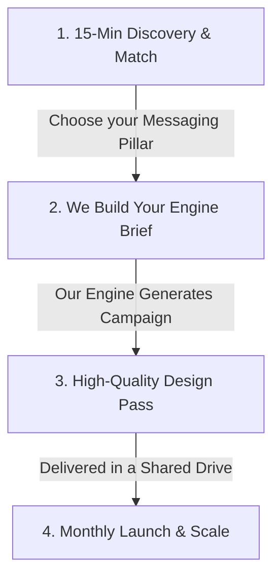

# ProPlan Solutions — Campaign-in-a-Box
### High-Converting Local Ad Creative for Dallas-Fort Worth HVAC Operators

> **"Your reputation deserves better creative."**
> You’ve spent years building trust in your local community. Don't let cheap stock photos or generic agency templates ruin your brand. We deliver hyper-local, custom ad bundles that look like your real team and speak directly to your DFW service areas.

---

## The Landscape: Why Traditional Marketing is Broken

| **Traditional Agency Retainers** | **DIY AI Tools & Templates** | **ProPlan Campaign-in-a-Box** |
| :--- | :--- | :--- |
| **Expensive:** $3,000+/month retainers locked into 6-month or 1-year contracts. | **Time-Consuming:** You have to learn prompting, crop images, and write copy yourself. | **Productized Price:** Standardized pricing starting at **$497/month** with no contracts. |
| **Bundled Waste:** You pay for ad account "management" and "reports" you don't read. | **Unprofessional:** Generates uncanny AI faces, weird hands, and generic text. | **Done-For-You:** Pure, high-performing creative delivered straight to your inbox. |
| **Slow:** Takes weeks to get a single campaign change or seasonal update approved. | **Inconsistent:** Hard to keep colors, logos, and neighborhood tone aligned. | **Turnkey & Fast:** 10 new custom ad variants and assets delivered every month. |

---

## What You Get in Your Monthly Campaign Bundle

Every month, we deliver a fresh, seasonally-timed campaign tailored specifically to the DFW climate (e.g., Spring/Fall prep, Summer emergency AC, Winter furnace tune-ups). 

### 1. 10 High-Performing Ad Creative Assets
* **Local Texas Visual Cues:** Photorealistic truck backdrops, real-trades aesthetics, and suburban Dallas-Fort Worth homes. 
* **Zero "AI Weirdness":** No creepy artificial faces. We use professional trade aesthetics with your brand colors and logo seamlessly integrated.
* **Format-Ready:** Optimized sizes for Instagram (1:1), Facebook (1.91:1), and Google Display.

### 2. Multi-Channel Copy Variants (Google & Meta)
* **High-Urgency Headlines:** Optimized for maximum click-through rates.
* **Service-Focused Primary Text:** Built around clear CTAs, highlighting your 24/7 service, local reviews, and upfront pricing.
* **No Policy Risks:** We hard-code safety checks to comply with Google/Meta ad rules (no spammy clickbait or prohibited claims).

### 3. One-Page Landing-Section Snippet
* **Conversion-First Design:** A simple, high-converting HTML/copy block for your site.
* **Consistent Journey:** Matches the exact messaging of your monthly ad campaign so prospects don't get lost when they click.

---

## Our 3 Messaging Pillars for DFW HVAC

We don't write generic ads. We map your brand to one of three proven local angles:

1. **The Reputation Leader:** *"Your reputation deserves better creative."* Built for legacy, multi-generation, or highly respected local companies. We showcase your reviews and professional trade standards.
2. **The Hyper-Local Neighbor:** *"Dallas-built, neighborhood-focused."* Target specific ZIP codes and local suburbs (e.g., Plano, Frisco, McKinney, Arlington) with localized messaging that generic agencies miss.
3. **The Review-Powered Specialist:** *"Don't take our word for it—ask your neighbors."* We turn your actual 5-star Yelp, Google, and ServiceTitan reviews into high-converting visual ad proof.

---

## How It Works: Zero Friction, No Retainers

* **Month-to-Month Flexibility:** Cancel anytime with a 5-day notice before your next billing cycle.
* **Immediate Turnaround:** First month’s campaign assets are delivered within 5 business days of your kickoff.

---

### Ready to elevate your local ad creative?
**Theo Torku**  
*ProPlan Solutions*  
[theo@proplansolutions.com](mailto:theo@proplansolutions.com) | DFW Local Operator  
*DFW Campaign Tier: $497/mo • Cancel Anytime*
